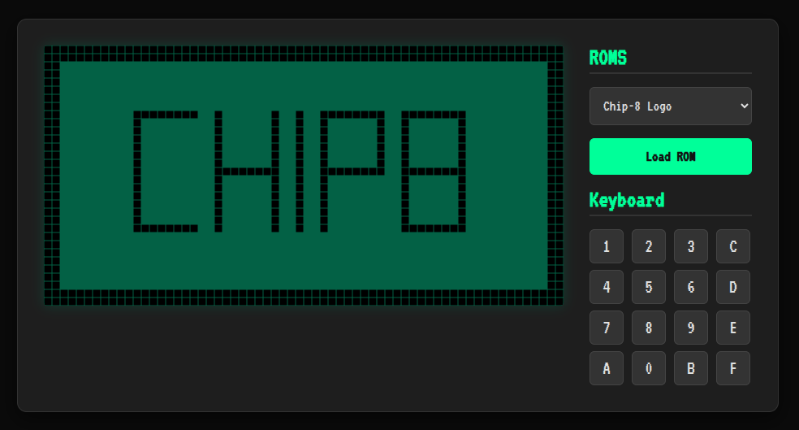

# chip8Emulator



## References

- [Cowgod's Chip-8 Technical Reference v1.0](http://devernay.free.fr/hacks/chip8/C8TECH10.HTM#keyboard)
- [loktar00 repositories](https://github.com/loktar00/chip8)
- [Videos](https://www.youtube.com/watch?v=YvZ3LGaNiS0&list=PLT7NbkyNWaqbyBMzdySdqjnfUFxt8rnU_)

# Criando um Emulador de CHIP-8 em JavaScript

O CHIP-8 é uma linguagem de programação interpretada que foi popular na década de 1970 para o desenvolvimento de jogos simples. Neste artigo, vamos explorar a criação de um emulador de CHIP-8 em JavaScript.

## Pré-requisitos

Para quem deseja seguir com esse artigo é necessário alguns pré-requisitos, como:

- Estudar e entender como funciona o Chip8. Para isso você deve ler a [Documentação do Chip8]().
- Estudar sobre operadores bit-a-bit.
- Estudar sobre báses numéricas, binário e hexadecimal.

## Introdução

O emulador de CHIP-8 em JavaScript é construído com base em um objeto `chip8`. O emulador utiliza o elemento `<canvas>` para exibir a saída gráfica do CHIP-8, permitindo que os jogos sejam renderizados e jogados no navegador.

## Estrutura do Código

Primeiro definimos a função construtora `chip8`, que inicializa o emulador e configura o ambiente gráfico. Vamos detalhar as principais partes do código:

### Inicialização

```javascript
const chip8 = function () {
  const cnv = document.getElementById("cnv");

  // Configuração do contexto 2D do canvas
  this.ctx = cnv.getContext("2d");
  this.pixelSize = 10;
  this.width = 64 * this.pixelSize;
  this.height = 32 * this.pixelSize;

  // Configuração do tamanho do canvas
  cnv.width = this.width;
  cnv.height = this.height;

  // Aqui chamamos o método init()
  this.init();
};
```

Nessa parte, a função construtora `chip8` recupera a referência do elemento `<canvas>` através do seu ID e configura o contexto 2D para desenho. O tamanho do canvas é definido com base no tamanho dos pixels do CHIP-8 (64x32) e a variável `pixelSize`. Logo depois é chamado o método `init`.

### Inicialização do CHIP-8

```javascript
chip8.prototype.init = function () {
  // Cria a memória do Chip8 (4096 bytes)
  this.memory = [4096];
  // Cria um array que pode armazenar os 16 registradores originais do Chip8
  this.register = [16];
  // Cria um array para representar a pilha de processos do Chip8
  this.stack = [16];
  // Cria a variável index que é utilizada por algumas instruções do Chip8
  this.index = null;
  // Cria a matriz do diplay do chip8
  this.display = new Array(64 * 32);
  // Variável que diz quando algo pode ser desenhado na tela
  this.displayFlag = false;
  this.step = 0;

  this.pc = 0x200; // contador de programa
  this.sp = null; // stack pointer

  // timers
  this.delayTimer = 0;
  this.soundTimer = 0;

  this.opcode = null;

  // Todas as fonts suportadas pelo Chip8
  const fonts = [
    0xf0,
    0x90,
    0x90,
    0x90,
    0xf0, // 0
    0x20,
    0x60,
    0x20,
    0x20,
    0x70, // 1
    0xf0,
    0x10,
    0xf0,
    0x80,
    0xf0, // 2
    0xf0,
    0x10,
    0xf0,
    0x10,
    0xf0, // 3
    0x90,
    0x90,
    0xf0,
    0x10,
    0x10, // 4
    0xf0,
    0x80,
    0xf0,
    0x10,
    0xf0, // 5
    0xf0,
    0x80,
    0xf0,
    0x90,
    0xf0, // 6
    0xf0,
    0x10,
    0x20,
    0x40,
    0x40, // 7
    0xf0,
    0x90,
    0xf0,
    0x90,
    0xf0, // 8
    0xf0,
    0x90,
    0xf0,
    0x10,
    0xf0, // 9
    0xf0,
    0x90,
    0xf0,
    0x90,
    0x90, // A
    0xe0,
    0x90,
    0xe0,
    0x90,
    0xe0, // B
    0xf0,
    0x80,
    0x80,
    0x80,
    0xf0, // C
    0xe0,
    0x90,
    0x90,
    0x90,
    0xe0, // D
    0xf0,
    0x80,
    0xf0,
    0x80,
    0xf0, // E
    0xf0,
    0x80,
    0xf0,
    0x80,
    0x80, // F
  ];

  // Inicialização da memória com os valores dos caracteres de fonte
  for (let i in fonts) {
    this.memory[i] = fonts[i];
  }
};
```

Nesse trecho, a função `init` inicializa as estruturas de dados do emulador, como a memória, registradores, pilha, índice e display. Além disso, os caracteres de fonte são carregados na memória.

### Carregando um ROM

```javascript
chip8.prototype.loadRom = function (rom) {
  for (let i = 0; i < rom.length; i++) {
    this.memory[0x200 + i] = rom[i];
  }

  // Chama o método cycle
  this.cycle();
};
```

Essa função `loadRom` é responsável por carregar um arquivo ROM (programa CHIP-8) na memória do emulador. Os bytes do programa são armazenados a partir do endereço 0x200, como é convencional em um emulador CHIP-8.

### Ciclo de Execução

```javascript
chip8.prototype.cycle = function () {
  this.opCode();

  // Nesse trecho está sendo configurado o delay timer
  // Essa parte e importante para configurar a frequência com que algo é desenhado na tela
  this.step++;
  if (this.step % 2) {
    if (this.delayTimer > 0) {
      this.delayTimer--;
    }
  }

  // desenha na tela
  if (this.displayFlag) {
    for (let i in this.display) {
      // configura as coordenadas x, y
      let x = i % 64; // garante que nada vai ser desenhado fora dessa largura
      let y = Math.floor(i / 64); // garante que nada vai ser desenhado fora dessa altura

      // Quando o valor do display for 1, vai ser desenhado um "pixel" preto na tela
      // se não o fundo vai ser desenhado em uma cor verde.
      if (this.display[i] == 1) {
        this.ctx.fillStyle = "#000";
        this.ctx.fillRect(
          x * this.pixelSize,
          y * this.pixelSize,
          this.pixelSize,
          this.pixelSize
        );
      } else {
        this.ctx.fillStyle = "#036145";
        this.ctx.fillRect(
          x * this.pixelSize,
          y * this.pixelSize,
          this.pixelSize,
          this.pixelSize
        );
      }
    }

    this.displayFlag = false;
  }

  setTimeout(this.cycle.bind(this), 1);
};
```

O método `cycle` implementa o ciclo de execução principal do emulador CHIP-8. Ele chama o método `opCode()` para ler e executar a próxima instrução do programa. Em seguida, ele atualiza o display caso haja alguma alteração pendente. Por fim, ele chama novamente o próprio método `cycle` usando `setTimeout` para criar um loop contínuo de execução.

### Interpretação do OpCode

```javascript
chip8.prototype.opCode = function () {
  let opcode = (this.memory[this.pc] << 8) | this.memory[this.pc + 1];
  /*
  Nessa linha, a variável `opcode` é definida. O `opcode` representa uma instrução
  de 16 bits no Chip-8. Aqui, estamos combinando dois bytes da memória (o byte em 
  `this.memory[this.pc]` e o byte seguinte em `this.memory[this.pc + 1])` para 
  formar o opcode completo. O operador `<<` realiza um deslocamento de bits para
   a esquerda, enquanto o operador `|` faz uma operação de "ou" bit a bit
  */
  let vx = (opcode & 0x0f00) >> 8;
  /*
  Nessa linha, a variável `vx` é definida. Ela representa o valor do registrador Vx,
  onde x é um dígito hexadecimal no opcode. Para obter o valor de Vx, usamos uma 
  operação de "e" bit a bit (`&`) com o opcode e uma máscara de bits `0x0f00`.
  Em seguida, realizamos um deslocamento de bits para a direita (`>>`)
   por 8 posições para obter o valor de Vx.
  */
  let vy = (opcode & 0x00f0) >> 4;
  /*
    Nessa linha, a variável `vy` é definida. Ela representa o valor do registrador
    Vy, onde y é um dígito hexadecimal no opcode. Assim como antes, usamos uma operação
    de "e" bit a bit (`&`) com o opcode e uma máscara de bits `0x00f0`. Em seguida, 
    realizamos um deslocamento de bits para a direita (`>>`) por 4 posições
    para obter o valor de Vy.
  */

  // Essas operações são usadas para extrair informações específicas do opcode,
  // como quais registradores estão sendo referenciados em uma determinada
  // instrução do Chip-8. Isso permite que o emulador interprete e execute
  // corretamente as instruções do programa Chip-8.

  // switch responsavel por identificar e executar cada instrução do chip8
  switch (opcode & 0xf000) {
    case 0x0000:
      switch (opcode & 0x00ff) {
        case 0x00e0:
          // clear display
          for (let i in this.display) {
            this.display[i] = 0;
          }
          this.displayFlag = true;
          break;

        case 0x00ee:
          // Return from a subroutine.
          // The interpreter sets the program counter to the address at the
          // top of the stack, then subtracts 1 from the stack pointer.
          this.pc = this.stack[this.sp];
          this.sp--;
          break;
      }
      break;
    case 0x1000:
      // Jump to location nnn.
      // The interpreter sets the program counter to nnn.
      this.pc = opcode & 0x0fff;
      break;

    case 0x2000:
      // Call subroutine at nnn.
      // The interpreter increments the stack pointer, then puts the current
      // PC on the top of the stack. The PC is then set to nnn.
      this.sp++;
      this.stack[this.sp] = this.pc;
      this.pc = opcode & 0x0fff;
      break;

    case 0x3000:
      // Skip next instruction if Vx = kk.
      // The interpreter compares register Vx to kk, and if they are equal,
      //  increments the program counter by 2.

      if (this.register[vx] == (opcode & 0x00ff)) {
        this.pc += 2;
      }
      break;

    case 0x6000:
      // Set Vx = kk.
      // The interpreter puts the value kk into register Vx.
      this.register[vx] = opcode & 0x00ff;
      break;

    case 0x7000:
      // Set Vx = Vx + kk.
      // Adds the value kk to the value of register Vx, then stores the result in Vx.
      this.register[vx] += opcode & 0x00ff;
      if (this.register[vx] > 255) {
        this.register[vx] -= 256;
      }
      break;

    case 0xa000:
      // Set I = nnn.
      // The value of register I is set to nnn.
      this.index = opcode & 0x0fff;
      break;

    case 0xd000:
      // Display n-byte sprite starting at memory location I at (Vx, Vy), set VF = collision.

      // The interpreter reads n bytes from memory, starting at the address stored in I.
      //  These bytes are then displayed as sprites on screen at coordinates (Vx, Vy).
      //  Sprites are XORed onto the existing screen. If this causes any pixels to be
      // erased, VF is set to 1, otherwise it is set to 0. If the sprite is positioned
      // so part of it is outside the coordinates of the display, it wraps around to
      // the opposite side of the screen. See instruction 8xy3 for more information
      // on XOR, and section 2.4, Display, for more information on the Chip-8 screen
      // and sprites.

      let height = opcode & 0x000f;
      let rx = this.register[vx];
      let ry = this.register[vy];

      this.register[0xf] = 0;

      for (let i = 0; i < height; i++) {
        // pega o pixel da memória que vai ser desenhado
        let currentPixel = this.memory[this.index + i];
        for (let c = 0; c < 8; c++) {
          if (currentPixel & 0x80) {
            let x = rx + c;
            let y = ry + i;

            // garante que nenhum pixel seja desennhado fora da tela.
            if (x >= 64) {
              x -= 64;
            }
            if (x < 0) {
              x += 64;
            }
            if (y >= 32) {
              y -= 32;
            }
            if (y < 0) {
              y += 32;
            }

            if (this.display[y * 64 + x] == 1) {
              this.register[0xf] = 1;
            }

            this.display[y * 64 + x] ^= 1;
          }

          currentPixel <<= 1;
        }
      }

      // configura do displayFlag pra true para que a função de desenho possa desenha-lo
      this.displayFlag = true;
      break;
  }
};
```

Nessa função, o método `opCode` lê o próximo OpCode da memória e realiza uma interpretação com base no valor inicial de 4 bits. Dependendo do valor do OpCode, diferentes ações são executadas, como chamadas de função para instruções específicas. Nesse método e muito importante que você tenha conhecimentos sobre operadores bit-a-bit e sobre bases numéricas.

OBS: Aqui estão sendo emuladas apenas algumas instruções do chip8, o suficiente para que possamos emular um programa simples de desenhar uma logo na tela.

OBS: Os comentários em inglês vem da documentação do chip8.

### Inicialização e Carregamento de ROM

```javascript
window.onload = function () {
  const chip = new chip8();

  // Carregando a ROM
  function loadRom() {
    let xhr = new XMLHttpRequest();
    xhr.open("GET", "./roms/Chip8 Picture.ch8", true);
    xhr.responseType = "arraybuffer";

    xhr.onload = function () {
      let rom = new Uint8Array(xhr.response);
      console.log(rom);
      chip.loadRom(rom);
    };

    xhr.send();
  }

  loadRom();
};
```

No trecho final do código, é feita a inicialização do emulador CHIP-8, a partir da criação de uma instância da função construtora `chip8`. Em seguida, uma ROM é carregada através do `XMLHttpRequest`. Depois guardamos os aquivos da rom em um array de 8 bits. Por fim, chamamos o método `loadRom` do `chip8` passando a nossa rom.

## Executando o Emulador

Para executar o emulador de CHIP-8, você precisa seguir os seguintes passos:

1. Certifique-se de ter um ambiente de desenvolvimento web configurado, com um navegador compatível com HTML5 e JavaScript.
2. Crie um novo arquivo HTML e inclua o seguinte código no `<body>`:

```html
<canvas id="cnv"></canvas>
<script src="chip8.js"></script>
```

3. Salve o arquivo HTML com o nome que desejar, por exemplo, `emulador-chip8.html`.
4. coloque o arquivo `chip8.js`, que contém o código-fonte do emulador CHIP-8, e salve-o na mesma pasta do arquivo HTML.
5. Abra o arquivo HTML no seu navegador.
6. O emulador CHIP-8 será carregado e começará a executar a ROM especificada no código, conforme o trecho mencionado anteriormente.
7. A tela do emulador será exibida no elemento `<canvas>`, identificado pelo ID "cnv".

## Conclusão

Nesse artigo eu quis mostrar como eu construi um emulador simples de chip8. Para que não ficasse muito extenso eu apenas coloquei o básico aqui. Quem gostar do projeto e quiser se aprofundar nele pode criar as outras funções do chip8, adicionar os inputs do teclado, som e o restante das instruções.

## Bibliografia

- [Código final - Emulador de Chip8 em JavaScript](https://github.com/joserochadev/chip8Emulator)
- [Documentação do Chip8](http://devernay.free.fr/hacks/chip8/C8TECH10.HTM#keyboard)
